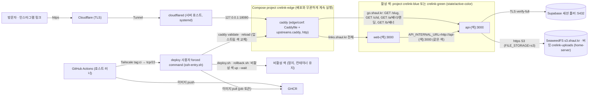

# 크리링 운영(prod) 배포와 CD 기술 설계

- 상태: 승인 (2026-10-06, 사용자가 배포 대상·CI 접속·비밀값·공개 경로를 선택. 세부 `[임시값]`은 운영하며 조정)
- 작성일: 2026-10-06
- 에픽: `docs/work/epics/0024-prod-deploy.md`
- 입력: [ADR 0010](../adr/0010-prod-deployment-topology.md)(제안), [배포 대상 아키텍처](../architecture/deployment-target.md), [환경과 비밀값 관리](../development/environment-secrets.md), 기존 [CI](../development/verification.md#ci), [MVP 기술 설계](crelink-mvp.md)

이 문서가 운영 배포의 설계 원본입니다. 사람이 따라 하는 절차는 [prod 런북](../../infra/docs/prod-runbook.md), 실행 가능한 원본은 [`infra/prod/`](../../infra/prod/README.md)와 `.github/workflows/deploy.yml`·`rollback.yml`입니다. `[사용자 준비]`는 저장소가 아니라 사용자가 계정·콘솔에서 하는 일입니다.

## 구성

Tunnel은 edge Caddy 하나로만 들어오고, edge Caddy는 활성 색의 `api-<색>`·`web-<색>`으로만 보냅니다. web은 같은 색 api를 부르므로 api·web은 항상 같은 릴리스 쌍입니다. 배포·롤백은 비활성 색에 새 릴리스를 올린 뒤 edge 업스트림을 reload로 바꾸고 옛 색을 멈추므로 두 색의 역할이 번갈아 바뀝니다([릴리스·배포·롤백](#릴리스배포롤백)). 방식 결정은 [ADR 0011](../adr/0011-zero-downtime-deploy.md)입니다.

| 항목 | 값 |
| --- | --- |
| 웹 | `https://links.shaul.kr` = `WEB_URL`. Google 리디렉션 URI `https://links.shaul.kr/auth/google/callback` `[임시값]` |
| 단축 | `https://go.shaul.kr` = `SHORT_LINK_BASE_URL` `[임시값, 정식 도메인이 정해지면 교체]` |
| 배포 대상 | `infra/prod/targets.json`의 `enabled` 항목. 지금 `home-server` 하나(Ubuntu 24.04 x86_64, Tailscale MagicDNS 이름 `home-server`, 플랫폼 `linux/amd64`) |
| 공개 | Cloudflare 원격 관리형 Tunnel(home-server는 기존 Tunnel `my-home-server`)의 공개 호스트 `go.shaul.kr`·`links.shaul.kr` → `http://localhost:18080` `[사용자 준비]`. 서버 공인 인바운드 포트 없음 |
| 관리·배포 접속 | Tailscale. CI는 임시 노드(`tag:ci`)로 서버 `deploy` 사용자 SSH(22)만 |
| DB | Supabase 프로젝트 1개(prod 전용). `DATABASE_URL` = Supavisor 세션 모드(5432), TLS `verify-full` |
| 이미지 | `ghcr.io/ai-worker-lab/crelink-api:<SHA>`(`apps/api/Dockerfile`), `ghcr.io/ai-worker-lab/crelink-web:<SHA>`(`apps/web/Dockerfile`, Next.js `output: 'standalone'`) |
| 업로드 저장소 | `FILE_STORAGE=s3`(compose `api.environment`로 고정): SeaweedFS(home-server의 별도 스택 [home-seaweedfs](https://github.com/shaul1991/home-seaweedfs)) `https://s3.shaul.kr`, 버킷 `crelink-uploads`, identity `crelink`(버킷 범위 읽기·쓰기). 볼륨 `crelink-prod_uploads`(`disk`)는 쓰지 않으며 되돌리기는 볼륨이 있던 릴리스로 롤백. 절차: [런북 9](../../infra/docs/prod-runbook.md#9-업로드-저장소) |

스택은 대상 서버의 다른 서비스(home-server의 호스트 Caddy 등)와 독립입니다. 호스트에 여는 포트는 edge Caddy의 `127.0.0.1:${CRELINK_HTTP_PORT:-18080}` 하나이고, 앱 색 스택은 호스트 포트를 열지 않습니다.

## 공개 경로와 Caddy 정책

원본은 [`infra/prod/Caddyfile`](../../infra/prod/Caddyfile)(edge Caddy가 읽는 사본은 서버 `/opt/crelink/edge/conf/Caddyfile`)입니다. 업스트림은 같은 폴더의 `upstreams.caddy` 스니펫(`api_upstream` = `api-<활성 색>:3000`, `web_upstream` = `web-<활성 색>:3000`)을 `import`합니다. 색 없는 `api`·`web` 이름은 두 색이 같은 네트워크에 함께 떠 있을 때 양쪽으로 풀리므로 Caddy·web 어디서도 쓰지 않습니다.

- 전역: `admin localhost:2019`(컨테이너 안에서만, reload용), `grace_period 30s`(reload·정지 때 진행 중 요청을 마칠 시간), `auto_https off`(TLS는 Cloudflare), `trusted_proxies static private_ranges` + `client_ip_headers CF-Connecting-IP`. Caddy에 붙는 것은 같은 호스트의 cloudflared뿐이라 사설 대역에서 온 `CF-Connecting-IP`를 방문자 주소(`{client_ip}`)로 믿습니다. 접근 로그는 켜지 않습니다.
- `http://{$CRELINK_SHORT_HOST:go.shaul.kr}`: `GET ^/[A-Za-z0-9][A-Za-z0-9-]{1,28}[A-Za-z0-9]$`(단축, `SLUG_PATTERN`·3~30자, API가 소문자로 찾음)와 `GET ^/(c/[a-z0-9]{10}|a/[a-z0-9]{10}/[a-z0-9]{10}|b/[a-z0-9]{10})$`(링크 클릭 `/c/`, 크리링 광고 클릭 `/a/{배너}/{랜딩}`, 크리에이터 배너 클릭 `/b/{배너}`, [광고 배너 설계](crelink-ad-banner.md#클릭))만 `api_upstream`으로, 나머지(`/api/*` 포함)는 404.
- `http://{$CRELINK_WEB_HOST:links.shaul.kr}`: 전부 `web_upstream`. `request_body max_size 6MB`(이미지 한도 `CRELINK_LIMITS.imageMaxBytes` 4MB + multipart 여유, 넘으면 413).
  - AI 운영자 토큰 경로 `/api/agent/…`(웹 route handler, [AI 운영자 설계](crelink-ai-operator.md#웹-토큰-경로-apiagentpath))도 같은 규칙으로 web에 갑니다. Caddy 변경은 없고 `Authorization`·`X-Crelink-Agent-Run` 헤더를 그대로 넘기며(`infra/prod/tests/caddy-routing.sh`가 확인), Bearer·허용 경로·Origin 판정과 API 전달은 web이 합니다.
- 업스트림에는 `X-Forwarded-For: {client_ip}` 하나만 보냅니다. 클라이언트가 보낸 `X-Forwarded-For`는 버려지고 API는 `TRUSTED_PROXY_HOPS=1`로 그 값을 방문·클릭 IP(R9)로 씁니다.
- 업스트림 연결: `lb_try_duration 10s`(연결 실패 시 재시도, 안전망), keep-alive 4초(Node `keepAliveTimeout` 5초보다 짧게 두어 닫힌 연결로 보낸 요청의 502와 옛 색 정지 지연을 막음).
- 웹의 서버 컴포넌트·BFF·구글 로그인 route handler는 공용 네트워크 `crelink-edge`의 같은 색 주소 `http://api-<색>:3000`(compose `web.environment`의 `API_INTERNAL_URL`)으로 API를 부르고 edge Caddy를 거치지 않습니다. 웹 코드의 `API_INTERNAL_TOKEN`(`X-Crelink-Internal` 헤더) 기능은 남아 있지만 운영에서는 값을 두지 않습니다.
- 헬스 포트: edge Caddy의 `:2020/healthz`는 edge 컨테이너 헬스체크 전용이고 호스트에 열지 않습니다. 앱 헬스는 api `:3000/api/health/ready`·web `:3000/privacy`(이미지 `HEALTHCHECK`)이고, 전환 전에 edge 컨테이너 안에서 새 색 별칭으로 같은 두 주소를 다시 확인합니다.

## 서버 배치

원본은 [`infra/prod/lib.sh`](../../infra/prod/lib.sh) 머리말과 `bootstrap.sh`·`cutover.sh`입니다.

| 경로 | 내용 |
| --- | --- |
| `/opt/crelink/releases/<SHA>/` | 커밋 SHA의 `infra/prod` 사본(시험·README·`*.example` 제외, `edge/compose.yaml` 포함). 성공하면 `.images.env`(그 릴리스의 `API_IMAGE`·`WEB_IMAGE`)를 남김 |
| `/opt/crelink/current` | 운영 중인(활성 색이 돌리는) 릴리스를 가리키는 심볼릭 링크 |
| `/opt/crelink/state/active-color` | 활성 색 `blue`·`green`. 없으면 blue/green 이전(cutover 전) 서버라 `deploy.sh`·`rollback.sh`·`geoip.sh --restart`가 아무것도 바꾸지 않고 거부 |
| `/opt/crelink/state/images.env` | 운영 중인 `API_IMAGE`·`WEB_IMAGE`(compose `--env-file`) |
| `/opt/crelink/state/releases.log` | 탭 구분: UTC 시각 / 동작(`deploy`·`rollback`, blue/green 이전 릴리스가 남긴 `restore`) / 이전 릴리스 / 새 릴리스 / API 이미지 / 웹 이미지. 전환에 성공했을 때만 씀 |
| `/opt/crelink/edge/compose.yaml` | edge 스택(project `crelink-edge`). `cutover.sh`가 릴리스의 `edge/compose.yaml`을 복사하고 배포는 건드리지 않음(바꾸려면 [런북 6-3](../../infra/docs/prod-runbook.md#6-3-edge-설정-갱신caddy-이미지-업그레이드)) |
| `/opt/crelink/edge/conf/` | edge Caddy의 `/etc/caddy`(폴더째 읽기 전용 bind): `Caddyfile`(활성 릴리스의 사본)·`upstreams.caddy`(활성 색). 배포·롤백이 원자적으로 바꾼 뒤 reload |
| `/etc/crelink/target` | 대상 이름(`targets.json`의 `name`). `secrets/<이름>.sops.env`를 고름 |
| `/etc/crelink/age.key` | 서버 age 개인키(root:deploy 640) |
| `/run/crelink/` | tmpfs(systemd-tmpfiles, deploy 0700). 복호화한 `app.env`를 compose 실행 동안만 둠 |
| `/usr/local/lib/crelink/ssh-entry.sh` | `deploy` SSH forced command(root 소유, `bootstrap.sh`만 설치) |

- Compose project: edge `crelink-edge`(`crelink-edge-caddy-1`), 앱은 같은 `compose.yaml`을 색마다 `crelink-blue`·`crelink-green`(`crelink-<색>-api-1`·`-web-1`, `CRELINK_COLOR`)으로 띄웁니다. 앱 compose에는 `name:`이 없어 항상 `lib.sh`(또는 런북 명령)가 `-p`로 실행합니다. blue/green 이전의 단일 project `crelink-prod`는 cutover 때 컨테이너·네트워크를 지웠습니다(볼륨 유지).
- Docker 네트워크 `crelink-edge`(외부 네트워크): edge와 두 색이 붙고 색 별칭 `api-<색>`·`web-<색>`만 씁니다. `bootstrap.sh`·`cutover.sh`가 만듭니다.
- 볼륨: GeoIP는 `crelink-prod_geoip`(`external: true`, blue/green 이전 이름을 이어 씀)를 두 색이 같이 씁니다. 업로드 볼륨 `crelink-prod_uploads`는 S3 전환과 함께 compose에서 뺐습니다(서버의 남은 볼륨 삭제는 [런북 9-5](../../infra/docs/prod-runbook.md#9-5-전환-뒤-볼륨-정리)).
- 서비스: edge `caddy`(`caddy:2.11.7-alpine`, 읽기 전용 루트, `cap_drop: all` + `NET_BIND_SERVICE`, 헬스 `:2020/healthz`). 색 스택 `api`(이미지 HEALTHCHECK `/api/health/ready`(DB만, 업로드 저장소 제외), `FILE_STORAGE=s3` 고정, 볼륨 geoip(ro)·`./certs`(ro)), `web`(이미지 HEALTHCHECK `/privacy`, 읽기 전용 루트, api가 healthy일 때 기동), 도구 프로필 `geoip-writer`(`alpine:3.24`, `geoip.sh`만 사용). api·web 모두 `init: true`, `stop_grace_period: 30s`, healthcheck `start_interval: 1s`.

## 비밀값과 환경변수

| 위치 | 키 | 비고 |
| --- | --- | --- |
| `infra/prod/secrets/<대상>.sops.env`(암호화) | `DATABASE_URL`, `GOOGLE_CLIENT_ID`, `GOOGLE_CLIENT_SECRET`, `OPERATOR_EMAILS`, `S3_ACCESS_KEY_ID`, `S3_SECRET_ACCESS_KEY` | API가 읽음(compose `env_file` = `/run/crelink/app.env`). S3 키 원본은 서버 `/opt/seaweedfs/config/s3.json`의 identity `crelink` |
| 같은 파일(평문, `.sops.yaml`의 `unencrypted_regex`) | `PORT=3000`, `WEB_URL`, `SHORT_LINK_BASE_URL`, `DATABASE_SSL=verify-full`, `DATABASE_SSL_CA_PATH=/etc/crelink/certs/supabase-ca.crt`, `DATABASE_POOL_MAX=6`(API pg Pool 상한, 산정은 [런북 12](../../infra/docs/prod-runbook.md#12-supabase-주의사항)), `FILE_STORAGE=s3`, `S3_ENDPOINT=https://s3.shaul.kr`, `S3_REGION=us-east-1`, `S3_BUCKET=crelink-uploads`, `UPLOAD_DIR=/data/uploads`(볼륨이 있던 릴리스로 롤백할 때용), `GEOIP_MMDB_PATH=/data/geoip/dbip-city-lite.mmdb`, `TRUSTED_PROXY_HOPS=1`, `SENTRY_DSN`(API Sentry 프로젝트 DSN, 비면 Sentry 꺼짐. 공개돼도 이벤트 전송만 되는 값), `SENTRY_ENVIRONMENT=production` | diff로 검토할 수 있게 평문. 정규식을 바꾸면 그 파일을 한 번 다시 암호화합니다([런북 9-2](../../infra/docs/prod-runbook.md#9-2-암호문에-키-넣기)) |
| `infra/prod/certs/supabase-ca.crt` | Supabase 루트 CA(공개 인증서) | api 컨테이너 `/etc/crelink/certs`에 읽기 전용 마운트 |
| `compose.yaml` `api.environment` | `FILE_STORAGE=s3` | `env_file`보다 우선. uploads 볼륨이 없는 compose에서 `disk`로 기동해 이미지가 컨테이너 안에만 저장되는 일을 막음 |
| `compose.yaml` `web.environment` | `API_INTERNAL_URL=http://api-${CRELINK_COLOR}:3000` | 같은 색 api. `API_INTERNAL_TOKEN`은 두지 않음 |
| API 이미지(`apps/api/Dockerfile`) | 빌드 인자 `SENTRY_RELEASE`(배포 커밋 SHA → 이미지 ENV), `SENTRY_ORG`·`SENTRY_PROJECT`(소스맵 업로드용). 런타임 `SENTRY_TRACES_SAMPLE_RATE`는 운영에 두지 않음(기본 0.1) | Sentry 결정은 [ADR 0012](../adr/0012-error-monitoring-sentry.md). 키 설명은 [API 문서](../../apps/api/docs/README.md#환경변수) |
| 웹 이미지(`apps/web/Dockerfile`) | 빌드 인자 `NEXT_PUBLIC_SENTRY_DSN`(웹 Sentry 프로젝트 DSN, 서버·브라우저 공용, 번들에 들어감), `SENTRY_RELEASE`, `SENTRY_ORG`·`SENTRY_PROJECT` | 빌드 시점 값이라 웹 이미지가 그 Sentry 프로젝트에 묶임(대상마다 다른 프로젝트면 따로 빌드). 비면 웹 Sentry 꺼짐 |
| 이미지 빌드 BuildKit secret | `sentry_auth_token`(= GitHub secret `SENTRY_AUTH_TOKEN`) | 있을 때만 두 Dockerfile 빌드 단계가 소스맵을 Sentry에 올림. 업로드가 실패하면 빌드 실패. 웹은 업로드 뒤 소스맵 파일을 지워 이미지에 없음 |
| `edge/compose.yaml` 변수 기본값 | `CRELINK_HTTP_PORT`(18080), `CRELINK_SHORT_HOST`(`go.shaul.kr`), `CRELINK_WEB_HOST`(`links.shaul.kr`) | 지금은 기본값만 씀. 대상별로 달라지면 전달 경로를 추가(후속) |
| 서버 `state/images.env` | `API_IMAGE`, `WEB_IMAGE` | `deploy.sh`·`rollback.sh`만 씀. 형식 `infra/prod/images.env.example` |
| `.sops.yaml` | 수신자 `operator`(운영자 키: macOS 키체인 `crelink-sops-age` + 운영자 비밀번호 관리자 백업), `home-server`(서버 `/etc/crelink/age.key`) | 대상 추가 시 그 서버 공개키를 수신자에 넣고 `sops updatekeys` |
| GitHub Actions variables | `TS_OIDC_CLIENT_ID`, `TS_OIDC_AUDIENCE`, `SENTRY_ORG`, `SENTRY_PROJECT_API`, `SENTRY_PROJECT_WEB`, `SENTRY_WEB_DSN` | Tailscale workload identity federation, Sentry 조직·프로젝트 slug와 웹 DSN(이미지 빌드 인자). 비밀 아님. Sentry 값이 없으면 빈 값으로 빌드해 업로드를 건너뛰고 웹 Sentry가 꺼짐 |
| GitHub Actions secret | `DEPLOY_SSH_KEY`, `SENTRY_AUTH_TOKEN` | `deploy` 사용자 배포 키(forced command), Sentry 조직 토큰(권한 `org:ci` 고정, 소스맵 업로드 전용. 앱 비밀값 아님) |
| job `GITHUB_TOKEN` | GHCR push(`packages: write`), 서버 pull(`packages: read`) | 서버 pull은 SSH stdin 첫 줄로 넘겨 일회 로그인 후 로그아웃. 서버·secrets에 레지스트리 장기 토큰 없음 |

- CI에는 앱 비밀값이 없습니다(`SENTRY_AUTH_TOKEN`은 빌드 때 소스맵을 올리는 토큰이라 앱 실행에 쓰이지 않음). 평문 비밀값은 서버의 `/run/crelink/app.env`에 compose 실행 동안만 있고 끝나면 지웁니다(실행 중 컨테이너 환경에는 남음).
- API는 `NODE_ENV=production`(이미지)에서 필수 키 누락·https 아님을 기동 단계에서 거부합니다([API 문서](../../apps/api/docs/README.md#환경변수)).

## 릴리스·배포·롤백

릴리스 = 커밋 SHA의 `infra/prod` 묶음(compose·Caddyfile·인증서·암호문·스크립트) + API 이미지 + 웹 이미지입니다. 설정·비밀값·공개 정책(Caddyfile)도 릴리스와 함께 배포·롤백됩니다. 배포·롤백·`geoip.sh --restart`는 모두 같은 색 전환(`lib.sh` `switch_color`)을 씁니다.

1. `ssh-entry.sh deploy <릴리스 SHA> <API SHA|-> <웹 SHA|->`: 인자 형식을 다시 검사하고, stdin 첫 줄(`<GHCR 사용자> <토큰>`) 뒤의 `infra/prod` tar.gz를 `releases/.incoming.*`에 풀어 `releases/<SHA>`로 옮긴 뒤 그 안의 `deploy.sh`를 실행합니다. `-`는 그 영역의 운영 중 이미지를 유지합니다(첫 배포는 둘 다 SHA). 롤백 뒤에는 운영 중 이미지가 옛 이미지이므로, 워크플로는 `-`를 쓰지 않고 항상 이미지 SHA(새로 만들었으면 이 커밋, 아니면 마지막 성공 배포 태그 `deploy/prod-api`·`deploy/prod-web`의 커밋)를 넘깁니다. `-`는 운영자가 서버에서 직접 쓸 때만 씁니다.
2. `deploy.sh`: 이미지 결정 → **아무것도 바꾸기 전에** 복호화·`docker compose config --quiet` 확인 → 레지스트리 로그인·없는 이미지만 pull·로그아웃 → edge 준비 확인(`state/active-color`, 네트워크 `crelink-edge`, `edge/conf`, 실행 중 edge 컨테이너. 하나라도 없으면 이미지만 받아 둔 채 종료 1, cutover는 자동으로 하지 않음) → 아래 3의 색 전환 → 성공하면 최근 5개와 운영 중인 것 외의 릴리스 폴더를 지웁니다. 마지막 줄은 `<릴리스> <API 이미지> <웹 이미지>`, 종료 0.
3. 색 전환(무중단): ① 활성 색의 반대가 다음 색 ② app.env 복호화 → 다음 색 project로 `docker compose up -d --remove-orphans --wait --wait-timeout 120`(api·web 헬스, 활성 색은 계속 서비스) ③ edge 컨테이너 안에서 `api-<다음 색>:3000/api/health/ready`·`web-<다음 색>:3000/privacy`(최대 10초) ④ 릴리스의 Caddyfile과 다음 색 `upstreams.caddy`를 `edge/conf/.next`에 쓰고 `caddy validate` → `mv` → `caddy reload`(이 순간 트래픽 전환, 진행 중 요청은 옛 색에서 끝남) ⑤ `state/active-color`·`current`·`state/images.env`·`releases.log`·릴리스의 `.images.env` 갱신 ⑥ drain `CRELINK_DRAIN_SECONDS`(기본 20초) 뒤 옛 색 `docker stop -t 30`(컨테이너는 남김) ⑦ app.env 삭제.
   - 헬스 판정은 이미지 `HEALTHCHECK`(api `/api/health/ready`, web `/privacy`, 10초 간격)를 쓰고, compose가 api·web에 `start_interval: 1s`(Compose가 함께 요구하는 `start_period`는 이미지와 같은 값)를 덧써 기동 중에는 1초마다 검사합니다. 옛 색 컨테이너는 SIGTERM 뒤 최대 `stop_grace_period: 30s` 동안 진행 중 요청을 마치고 끝납니다(넘으면 SIGKILL).
4. **실패하면 활성 색 불변**: ②~④ 중 하나라도 실패하면(새 색 헬스 실패, edge 내부 헬스 실패, `caddy validate`·`reload` 실패) 최근 로그 30줄을 출력하고 새 색만 `down`합니다. 트래픽은 전환 전 색에 그대로 있고 `state/active-color`·`current`·`images.env`·`releases.log`도 바뀌지 않으므로 직전 릴리스를 다시 올리는 복구가 필요 없습니다. 종료 코드: 0 성공, 1 실패(아무것도 바꾸지 않음), 2 reload 실패 뒤 이전 edge 설정 파일로도 reload하지 못함(edge 설정이 어긋났을 수 있어 즉시 [런북 11](../../infra/docs/prod-runbook.md#11-장애-대응)).
5. `rollback.sh [릴리스 SHA]`(`ssh-entry.sh rollback`이 `current/rollback.sh`를 실행): 인자가 없으면 `releases.log`에서 지금 릴리스를 배포한 마지막 `deploy` 줄의 이전 릴리스를 고릅니다(`rollback` 줄은 보지 않으므로 연달아 실행하면 배포 이력을 한 단계씩 거슬러 감). 대상 폴더와 `.images.env`가 남아 있어야 하고(최근 5개), 이미지가 서버에 없을 때만 pull합니다. 그 릴리스를 위 3과 같은 전환으로 비활성 색에 올립니다(무중단). blue/green 이전 형식 릴리스(compose에 `caddy`가 있거나 `name: crelink-prod`)는 아무것도 바꾸지 않고 종료 1이며, 그 릴리스로 돌아가는 길은 `cutover.sh --revert`뿐입니다([런북 14-5](../../infra/docs/prod-runbook.md#14-5-되돌리기)). 실패 처리·종료 코드는 `deploy.sh`와 같습니다.
6. `geoip.sh --restart`: GeoIP 파일을 활성 색 project로 볼륨에 쓴 뒤 지금 릴리스·이미지를 반대 색에 다시 올려 같은 전환을 합니다(`releases.log`에는 쓰지 않음).
7. `ssh-entry.sh status`: 운영 릴리스, 활성 색(`color blue|green|-`), `images.env`, `releases.log` 마지막 5줄.
8. cutover(서버마다 한 번): blue/green 이전 단일 스택 `crelink-prod`(스택 안 caddy가 18080을 쥠)에서 edge + `crelink-blue`로 옮기는 일은 운영자가 서버에서 직접 실행하는 `cutover.sh`(사전 점검·`--dry-run`·멱등·자동 원복, `--revert`로 되돌리기)입니다. 워크플로·`ssh-entry.sh`로는 실행되지 않습니다. 절차: [런북 14](../../infra/docs/prod-runbook.md#14-bluegreen-cutover).

**운영 결과(무중단)**: home-server는 2026-10-06T21:16Z에 cutover했고 그때 한 번 생긴 공백은 0.5초였습니다(대상마다 0.1초 간격 측정). 그 뒤 서버에서 부하(3개 경로 합계 초당 30건, 약 9초 걸리는 느린 요청, 운영자 회선의 공개 주소 루프)를 흘리며 배포 4회·롤백 6회·헬스 실패 배포 1회·`geoip.sh --restart` 1회를 했고 모든 요청이 성공했습니다(5xx·연결 오류 0건, 느린 요청 전부 완료, 성공 응답 최장 0.08초 이하). 헬스 실패 배포는 새 색만 내리고 활성 색·트래픽을 바꾸지 않았고(종료 1), 옛 색 api·web은 매번 drain 20초 뒤 `Exited (0)`(강제 종료 아님)로 멈췄으며, DB 연결은 겹치는 구간에도 전체 20·크리링 8 이하였습니다. 측정 방법은 [런북 6-1](../../infra/docs/prod-runbook.md#6-1-배포-공백-측정), 실행 기록(시각·릴리스·run)은 `docs/work/orchestrator/0036-zero-downtime-cutover-verify.md`입니다. 남는 공백은 edge 재생성(Caddy 이미지·포트·마운트 변경, 1~2초[추정])뿐이고 아래 "위험·후속"에 있습니다.

Next.js 16(0039)부터 웹 standalone 서버는 SIGTERM에 진행 중 요청을 마친 뒤 종료 코드 143(신호로 정상 종료, SIGKILL 137 아님)으로 끝나므로, 이후 옛 색 web은 `Exited (143)`로 남는 것이 정상입니다([웹 README "종료 동작"](../../apps/web/README.md)).

## 워크플로

| 워크플로·job | 내용 |
| --- | --- |
| `ci.yml` `이미지 빌드 api`·`web` | PR마다 두 이미지를 `linux/amd64`로 빌드만 합니다(푸시 없음, gha 캐시). `ci.yml`은 main push에서 돌지 않습니다(0060) |
| `deploy.yml` 트리거 | main `push`(PR 머지, CI를 다시 기다리지 않음) 또는 main에서 `workflow_dispatch`(`force`: 변경과 무관하게 두 이미지 새로 빌드). 동시 실행 그룹 `deploy-prod`(취소 안 함, `rollback.yml`과 공유) |
| `plan` | 배포 커밋, 변경 영역(태그 기준: `api` ← `deploy/prod-api` 이후 `apps/api/`·`packages/shared/`·`pnpm-lock.yaml`·`.dockerignore`, `web` ← `deploy/prod-web` 이후 `apps/web/`·`packages/shared/`·`packages/design-tokens/`·같은 두 파일, `release` ← `deploy/prod` 이후 위 경로나 `infra/prod/`. 태그가 없으면 그 영역 예), `targets.json`의 `enabled` 대상 matrix와 플랫폼 합집합, 접속 설정 준비 여부(`vars.TS_OIDC_*`·`DEPLOY_SSH_KEY`가 없으면 배포를 건너뛰고 경고) |
| `image` | matrix `api`·`web` 중 바뀐 영역만 GHCR `:<SHA>`로 push. 플랫폼에 arm64가 있을 때만 QEMU. 빌드 인자 `SENTRY_RELEASE=<배포 커밋 SHA>`·`SENTRY_ORG=vars.SENTRY_ORG`·`SENTRY_PROJECT`(api `vars.SENTRY_PROJECT_API`, web `vars.SENTRY_PROJECT_WEB`), 웹만 `NEXT_PUBLIC_SENTRY_DSN=vars.SENTRY_WEB_DSN`, BuildKit secret `sentry_auth_token=secrets.SENTRY_AUTH_TOKEN`. 토큰이 있으면 소스맵 업로드(실패하면 빌드 실패), 없으면 건너뜀 |
| `deploy` | 대상 matrix(`max-parallel: 1`, `fail-fast`). `release`가 예이고 접속 설정이 있을 때. Tailscale(OIDC, `tag:ci`, 대상 `ping`) → `ssh deploy@<host> "deploy <SHA> <api 이미지 SHA> <web 이미지 SHA>"`(이미지 SHA는 plan의 `api_image`·`web_image`), stdin = GHCR 사용자·토큰 + `infra/prod` tar.gz(`tests`·`README.md`·`*.example`·`.env` 제외). 호스트 신원은 Tailscale이 보증하므로 `StrictHostKeyChecking accept-new`. 이어서 같은 job에서 `ssh deploy@<host> verify`(운영 주소 검사), 실패하면 `rollback`(직전 릴리스) 뒤 다시 `verify`하고 job 실패 |
| 운영 주소 검사(`infra/prod/verify.sh`) | 배포 대상 서버가 Cloudflare를 거쳐 공개 주소를 불러 11개를 검사: 웹 `/` 200, `/privacy` 200, BFF `/api/backend/api/health` 200, AI 토큰 경로 `/api/agent/api/health`(토큰 없음) 401, `go.shaul.kr/zzz-e2e-none` 302 → `https://links.shaul.kr/notice?reason=link_not_found`, 배너 클릭 `go.shaul.kr/b/zzzzzzzzzz`·`/a/zzzzzzzzzz/zzzzzzzzzz` 302 → `https://links.shaul.kr/notice?reason=link_unavailable`, `go.shaul.kr/api/health` 404. 주소는 릴리스 암호문의 평문 키 `WEB_URL`·`SHORT_LINK_BASE_URL`. 검사 스크립트는 활성 릴리스(`current`)의 것이라 롤백 뒤에는 그 릴리스의 검사를 씁니다. 러너에서 부르지 않는 이유: Cloudflare가 GitHub 러너(데이터센터 IP) 요청을 403으로 막음(2026-10-07 확인) |
| `record` | 성공 시 태그 `deploy/prod`와 바뀐 영역의 `deploy/prod-api`·`deploy/prod-web`를 배포 커밋으로 옮김(다음 변경 비교 기준) |
| `rollback.yml` | main에서 `workflow_dispatch`(입력 `target` 기본 `home-server`, `release` SHA 선택) → Tailscale → `ssh deploy@<host> "rollback [SHA]"`(배포와 같은 무중단 전환) → `ssh deploy@<host> verify`(운영 주소 검사, 위와 같음) |

## DB migration 운영 규칙

API 기동 시 migration이 돌고(세션 advisory lock, 그래서 트랜잭션 풀러 6543 금지), 새 색이 헬스에 실패하면 전환하지 않아 옛 색이 계속 서비스합니다. migration은 새 색이 기동할 때 이미 적용되므로 전환 전까지(헬스 대기 + drain 20초)와 실패한 배포 뒤에는 옛 코드가 새 스키마 위에서 돌고, 롤백된 이전 코드도 새 스키마에서 동작해야 합니다. 그래서 컬럼·테이블 삭제는 쓰는 코드를 먼저 배포한 다음 배포에서 합니다(expand/contract, 배포마다 적용되는 필수 조건).

## 보안 경계와 한계

- **GitHub Free 조직의 비공개 저장소**: 브랜치 보호·environment secrets·deployment branches가 없어 push 권한이 있으면 워크플로를 고쳐 모든 secret을 읽을 수 있습니다. 그래서 CI에는 앱 비밀값을 두지 않고, tailnet 진입은 Tailscale workload identity의 `sub` 조건(`repo:ai-worker-lab@271170671/crelink@1406726921:ref:refs/heads/main`, GitHub 불변 subject 형식)으로 main 브랜치 job만 허용합니다. `DEPLOY_SSH_KEY`가 새도 tailnet 밖에서는 쓸 수 없고, tailnet 안에서도 forced command로 배포·롤백·상태 조회만 됩니다.
- **main 병합 = 서버 실행 권한**: main의 `infra/prod/compose.yaml`이 서버에서 복호화된 비밀값과 함께 실행됩니다. main에 병합할 수 있는 사람(에이전트 포함)은 비밀값을 읽는 컨테이너를 넣을 수 있습니다. 운영자가 `infra/prod/` 변경을 리뷰하는 것이 통제 수단입니다(별도 운영 저장소 대안은 ADR 0010).
- **docker 그룹 = root**: `deploy`는 docker 그룹이라 서버 root와 같습니다. 배포 키는 forced command(`restrict`, 셸·포워딩 없음)로 줄이고, 운영자 관리 접속은 Tailscale로 별도입니다.
- **Tailscale Personal 무료 플랜은 비상업 조건**입니다. 상업 운영 전 Standard 등으로 바꿉니다. ephemeral 노드 사용량 한도도 이 플랜 기준입니다.
- **Sentry 토큰**: `SENTRY_AUTH_TOKEN`도 위와 같은 이유로 push 권한자가 읽을 수 있습니다. 조직 토큰이라 권한이 `org:ci`(릴리스·소스맵 업로드)로 고정되고 이벤트 읽기·조직 설정 변경은 없지만[추정: 공식 문서의 `org:ci` 설명 기준], 새면 Sentry에서 폐기·재발급합니다([런북 15](../../infra/docs/prod-runbook.md#15-sentry-오류성능-모니터링)).
- **방문자 IP 신뢰**: edge Caddy는 사설 대역에서 온 `CF-Connecting-IP`를 믿습니다. 호스트 포트를 127.0.0.1에만 열어 외부 위조를 막고, 이 포트를 공인 주소에 열지 않습니다. 공용 네트워크 `crelink-edge`의 다른 컨테이너(두 색의 api·web)도 사설 대역이지만 edge Caddy를 부르지 않습니다(web은 같은 색 api를 바로 부름).
- **단일 서버·가정 회선**: 서버·회선 장애가 곧 서비스 장애입니다. 업로드 저장소(SeaweedFS)도 같은 home-server·회선에 있어 S3로 옮겨도 데이터 위치와 가용성은 그 서버에 묶입니다(아래 위험).
- 평문 비밀값은 실행 중 컨테이너 환경(`docker inspect`)에서는 보입니다. 서버 root·docker 그룹 접근을 줄이는 것으로 막습니다.

## 이식 규칙

다른 대상(OCI ARM, AWS 등)으로 옮기거나 추가할 때 같은 절차가 되도록 지킵니다. 절차는 [런북 "배포 대상 추가와 Tunnel 전환"](../../infra/docs/prod-runbook.md#10-배포-대상-추가와-tunnel-전환)입니다.

1. 배포 단위는 불변 이미지 SHA + 저장소 `infra/prod` + 대상별 sops 파일뿐입니다. 서버에서 손으로 고친 파일·서버에만 있는 스크립트·`latest` 태그를 두지 않습니다. 대상별 차이는 `targets.json` 항목과 `secrets/<대상>.sops.env`에만 둡니다.
2. 이미지는 멀티 아키텍처로 만들 수 있게 유지합니다. API는 `$BUILDPLATFORM` 교차 빌드를 유지하고 native 애드온 의존성을 피합니다. 런타임 베이스는 amd64·arm64를 모두 내는 이미지만 씁니다.
3. 공개는 어디서나 Cloudflare Tunnel → edge Caddy(`127.0.0.1:18080`) → 활성 색입니다. 서버에 공인 인바운드를 열지 않고 Caddyfile을 대상별로 나누지 않습니다. 호스트 이전은 Tunnel 공개 호스트(또는 CNAME)를 새 대상 Tunnel로 바꾸는 것으로 합니다.
4. 업로드는 서버 볼륨이 아니라 S3 호환 저장소에 둡니다(`FILE_STORAGE=s3`, 지금 SeaweedFS `https://s3.shaul.kr`). 대상은 같은 `S3_*` 키를 암호문에 넣기만 하면 되고 볼륨 복사가 없으며, 여러 대상이 같은 버킷을 함께 쓸 수 있습니다. 저장소를 바꿀 때(예: Cloudflare R2, `S3_REGION=auto`)는 `aws s3 sync`로 버킷을 복사하고 키만 바꿉니다. 저장소는 조건부 PUT(`If-None-Match: *`)을 지원해야 합니다([API 문서](../../apps/api/docs/README.md#이미지-저장소)).
5. 관리 접속은 Tailscale 하나로 통일합니다.
6. 비밀 원본은 sops 암호문이고 CI에 두지 않습니다.
7. 헬스·전환 계약을 대상과 무관하게 유지합니다: 이미지 HEALTHCHECK, 비활성 색 `up --wait` → edge 안 내부 헬스 → `caddy validate`·`reload`로만 트래픽 전환, 실패하면 새 색만 내리고 활성 색·`current`·트래픽 불변(종료 1), 성공했을 때만 `state/active-color`·`releases.log` 갱신, 롤백도 같은 전환. `deploy.sh`·`rollback.sh`·`ssh-entry.sh`의 인자·종료 코드(0/1/2)·마지막 줄과 `releases.log` 형식은 바꾸지 않습니다. web→api는 같은 색 별칭만 씁니다.
8. 서버 준비는 `bootstrap.sh`(패키지·`deploy` 사용자·`ssh-entry.sh`, 네트워크 `crelink-edge`, 볼륨 `crelink-prod_geoip`, `/opt/crelink/edge/conf`)로 재현하고, 새 대상의 첫 edge·blue 기동은 `cutover.sh`(옛 스택이 없으면 공백 단계를 건너뜀)로 합니다([런북 5](../../infra/docs/prod-runbook.md#5-최초-배포)·[10](../../infra/docs/prod-runbook.md#10-배포-대상-추가와-tunnel-전환)). 서버가 2대 이상이 되거나 관리형으로 옮기면 OpenTofu를 검토합니다. 무중단 배포 방식은 [ADR 0011](../adr/0011-zero-downtime-deploy.md)(승인, home-server에 적용됨: 고정 edge Caddy + Blue/Green)입니다.

## 변경 범위

| 티켓 | 역할 | 내용 |
| --- | --- | --- |
| 0025 | api | `apps/api/Dockerfile`(빌더 플랫폼에서 빌드해 대상 플랫폼 런타임으로 옮김, amd64·arm64), 컨테이너 헬스체크, `TRUSTED_PROXY_HOPS`, Supabase TLS(`DATABASE_SSL`·CA), 운영 필수 설정 검증, 통합 테스트 |
| 0026 | web | 웹 운영 컨테이너 이미지(`apps/web/Dockerfile`, `output: 'standalone'`, 헬스체크 `/privacy`), 서버 측 API 호출 헤더 공용화(`apiRequestHeaders()`, 내부 토큰 기능은 남지만 운영 미사용), 환경변수 문서 |
| 0027 | infra | `infra/prod/`: `compose.yaml`(caddy·api·web), `Caddyfile`, `targets.json`, `secrets/`·`certs/`, `lib.sh`·`deploy.sh`·`rollback.sh`·`ssh-entry.sh`·`geoip.sh`·`bootstrap.sh`, 로컬 시험, 런북, `infra/CHANGELOGS.md` |
| 0028 | orchestrator | `.github/workflows/deploy.yml`·`rollback.yml`, CI `이미지 빌드`, `.sops.yaml`, `.dockerignore`, `dependabot.yml`, 문서 |
| 0029 | orchestrator | home-server 준비(bootstrap·age 키·Tailscale·Tunnel), 최초 배포와 실서비스 검증 |
| 0030 | orchestrator | 업로드 S3 호환 저장소: API `S3FileStorage`·`FILE_STORAGE`·`S3_*`, 저장소 계약 시험(SeaweedFS 컨테이너), `.sops.yaml` 평문 키, compose 주석·볼륨 정리 절차, 런북 9 |
| 0031 | 에픽 | 운영 무중단 배포: 0단계(0032~0034) → Blue/Green(0035) → 운영 cutover·검증(0036), 통합 수용 기준(부하 중 배포·롤백 5xx·연결 오류 0건) |
| 0032 | api | SIGTERM graceful shutdown(`apps/api/src/shutdown.ts` `enableGracefulShutdown`: 새 연결 거부 → 진행 중 요청 완료 → pool 종료), pool 상한 `DATABASE_POOL_MAX` |
| 0033 | web | standalone 서버 SIGTERM 동작 실측(진행 중 요청을 마치고 종료해 코드 변경 없음), 종료 동작 문서 |
| 0034 | infra | compose api·web `stop_grace_period: 30s`·healthcheck `start_interval: 1s`, 암호문 평문 키 `DATABASE_POOL_MAX=6`, 배포 공백 측정 `measure-gap.sh`(런북 6-1) |
| 0035 | infra | edge 스택 `edge/compose.yaml`(project `crelink-edge`), Caddyfile(`admin localhost:2019`·`grace_period 30s`·`import upstreams.caddy`·`lb_try_duration`·keep-alive 4초), 색 스택 `compose.yaml`(`crelink-blue`·`crelink-green`, 별칭 `api-<색>`·`web-<색>`, GeoIP 외부 볼륨), `lib.sh` `switch_color`, `deploy.sh`·`rollback.sh`·`geoip.sh`·`bootstrap.sh`·`ssh-entry.sh status`, `cutover.sh`(`--revert`), 시험 `zero-downtime.sh`·`cutover-rehearsal.sh`·`deploy-rollback.sh`, 런북 6-2·6-3·14 |
| 0036 | orchestrator | home-server cutover(공백 0.5초)와 부하 중 배포 검증, 이 문서·`deploy.yml`·`rollback.yml` 주석·`dependabot.yml`(edge compose)·관련 문서를 현재 동작으로 |
| 0042 | orchestrator | Sentry 오류·성능 모니터링([ADR 0012](../adr/0012-error-monitoring-sentry.md)): API `@sentry/nestjs`·웹 `@sentry/nextjs`, DSN 없으면 꺼짐, 두 Dockerfile 소스맵 업로드(BuildKit secret), `deploy.yml` 빌드 인자·secret, `.sops.yaml` 평문 키 `SENTRY_DSN`·`SENTRY_ENVIRONMENT`, `/privacy` 국외 이전 고지, 런북 15 |
| 0052 | orchestrator | Sentry 무료 요금제 기능([ADR 0014](../adr/0014-sentry-free-plan-features.md)): API Logs·업무 지표·Cron 체크인(`crelink-api-retention`), 웹 오류 세션 리플레이·브라우저 세션·콘솔 로그·관리 화면 의견 보내기, Sentry 화면의 Uptime(`/api/backend/api/health`)·Inbound filters, `/privacy`, 런북 15. 배포 설정·키 변경 없음 |

## 위험·후속 `[임시값]`

- Supabase 무료 플랜: 자동 일시정지·백업 제한. 출시 전 유료 전환 또는 백업 절차 필요.
- **배포 중 502 → 해소(0036)**: 배포·롤백·`geoip.sh --restart`는 Blue/Green 무중단 전환이고, 운영에서 cutover 뒤 부하 중 배포 4회·롤백 6회·헬스 실패 배포 1회·GeoIP 재기동 1회 동안 요청 실패 0건이었습니다(위 "운영 결과"). 남은 위험:
  - **이전 형식 릴리스로 롤백 불가**: cutover 전 릴리스(compose에 `caddy`가 있거나 `name: crelink-prod`, 예: `433dc88`)는 `rollback.sh`가 거부합니다(종료 1, 무변경). 그 릴리스로 돌아가려면 `cutover.sh --revert`(수십 초 공백이 있던 옛 구조로 돌아감)이고, 최근 5개 정리로 그 릴리스 폴더가 지워지면 [런북 14-6](../../infra/docs/prod-runbook.md#14-6-종료-2와-수동-복구)의 수동 복구만 남습니다. 옛 구조의 코드·설정이 필요하면 그 변경을 main에 새로 병합해 배포합니다.
  - **edge 재생성 1~2초 공백**: edge compose(Caddy 이미지·포트·마운트·환경변수) 변경은 reload로 반영되지 않아 edge 컨테이너를 다시 만들어야 하고 그동안 18080 리스너가 없습니다(1~2초[추정], cutover의 caddy 교체는 운영 0.5초). 배포가 하지 않고 운영자가 트래픽이 적은 시각에 [런북 6-3](../../infra/docs/prod-runbook.md#6-3-edge-설정-갱신caddy-이미지-업그레이드)으로 합니다. Dependabot이 `infra/prod/edge`의 Caddy 이미지 갱신 PR을 열어도 병합 배포만으로는 서버 edge가 바뀌지 않습니다.
  - **DB 연결 2배**: 새 색 기동부터 옛 색 정지까지 구·신 API가 함께 돌아 연결이 최대 `2 × DATABASE_POOL_MAX`(12)입니다. Supabase Pool Size(15, 대시보드 확인)를 넘으면 새 색 readiness가 실패해 배포가 실패합니다(트래픽 영향 없음). Pool Size·compute·`DATABASE_POOL_MAX`를 바꿀 때 [런북 12](../../infra/docs/prod-runbook.md#12-supabase-주의사항)의 식을 다시 봅니다. 같은 구간에 Node 프로세스 메모리도 2벌입니다.
  - **`cutover.sh`는 서버마다 1회용**: blue/green 이전 서버를 옮기거나(이미 옮긴 home-server는 다시 실행해도 "이미 cutover됨"으로 종료 0) 새 대상의 첫 edge·blue를 띄울 때만 씁니다. 되돌리기(`--revert`)는 옛 릴리스 폴더·`.images.env`·이미지가 서버에 남아 있을 때만 됩니다.
- 업로드 저장소 SeaweedFS는 home-server 한 대(단일 master·volume·filer, 복제 없음)와 가정 회선·Cloudflare Tunnel에 의존합니다. 서버·회선·SeaweedFS 장애면 이미지 업로드·조회가 500이 되고(단축 이동은 영향 없음, readiness에 넣지 않음), 디스크가 망가지면 데이터를 잃습니다. 백업은 SeaweedFS 데이터 디렉터리 백업(home-seaweedfs README "운영")이 맡고 아직 정기 실행·서버 밖 보관이 정해지지 않았습니다. API를 다른 대상으로 옮겨도 이미지 가용성은 home-server에 남으므로, 그때 Cloudflare R2 등 관리형 저장소로 옮길지 정합니다(사용자 결정).
- OCI 대상 추가는 필요할 때 `targets.json`에 `enabled: false`로 준비한 뒤 런북대로. 웹 이미지 arm64 빌드(QEMU) 시간은 그때 확인하고, 느리면 네이티브 arm64 러너로 나눕니다.
- 대상별로 다른 호스트·포트가 필요해지면 edge compose 변수 전달 경로를 추가합니다(지금은 기본값).
- GeoIP 파일은 서버에서 월 1회 갱신(`geoip.sh --restart`, 런북). 없으면 위치만 비어 있음.
- 단축 도메인(`go.shaul.kr`)은 임시. 정식 도메인이 정해지면 `SHORT_LINK_BASE_URL`·Caddy 호스트·Tunnel 공개 호스트를 함께 바꿉니다. 이미 인스타그램에 걸린 링크는 옛 도메인이 유지되어야 합니다.
- 속도 제한(rate limit)·WAF는 Cloudflare 무료 기능으로 시작하고 부족하면 Caddy 쪽을 추가합니다(후속).
- 이미지 한도 4MB는 MVP 임시값입니다. edge Caddy의 `request_body` 6MB가 웹 호스트 본문 상한입니다.
- Sentry([ADR 0012](../adr/0012-error-monitoring-sentry.md), [ADR 0014](../adr/0014-sentry-free-plan-features.md)): 무료(Developer) 요금제는 사용자 1명, 월 오류 5천 건·span 500만 개·리플레이 50건, 보관 30일이라 오류가 폭주하면 그 달 나머지 이벤트·리플레이를 받지 못합니다. 브라우저 이벤트는 광고 차단기에 일부 막힙니다(`tunnelRoute` 미사용). Sentry 장애 때 토큰이 있으면 소스맵 업로드 실패로 이미지 빌드·배포가 막히므로, 급하면 secret `SENTRY_AUTH_TOKEN`을 지우고 다시 실행합니다(소스맵 없이 배포). 웹 DSN이 빌드 시점 값이라 웹 이미지가 Sentry 프로젝트에 묶입니다. Uptime·Cron 모니터와 Inbound filters는 저장소가 아니라 Sentry 화면 설정입니다(Cron은 코드가 upsert). 설정·끄기는 [런북 15](../../infra/docs/prod-runbook.md#15-sentry-오류성능-모니터링).

## 검증 계획

- 로컬: 두 이미지 빌드, 색마다 `CRELINK_COLOR=<색> CRELINK_APP_ENV=/dev/null docker compose -f infra/prod/compose.yaml --env-file infra/prod/images.env.example config --quiet`와 `docker compose -f infra/prod/edge/compose.yaml config --quiet`, `bash -n`·`shellcheck`, `infra/prod/tests/*.sh`(Caddy 공개 정책, 배포·롤백·실패 무변경 시뮬레이션, 부하 중 배포·롤백 오류 0건, cutover 리허설), `pnpm verify`·`pnpm e2e`.
- 워크플로: `actionlint`, 로컬에서 실행할 수 없는 단계는 서버 준비 후 0029에서 실제 실행.
- 실서비스(0029): 최초 배포, 운영 주소 smoke, 구글 로그인, 단축 URL 클릭 기록(IP가 방문자 IP), 자동 배포·자동 롤백·수동 롤백 각 1회.
- 업로드 저장소(0030): API 저장소 계약 시험(disk·SeaweedFS 4.47 컨테이너), 운영 전환 때 런북 9-3의 확인(파일 수·`--dryrun`·이미지 200·운영 경로 조건부 PUT 412).
- 무중단 전환(0035·0036): 로컬 `zero-downtime.sh`(부하 중 배포 2회·롤백 2회 오류 0건)·`cutover-rehearsal.sh`, 운영 cutover 공백 측정(`measure-gap.sh`)과 부하 중 배포.

## 검토 기록

- 2026-10-06: 빠른 진행을 위해 역할별 설계 검토를 생략하고 사용자 선택을 승인 근거로 둠.

## 변경 기록

- 2026-10-06: 처음 설계(웹 Vercel + API OCI 서버 공용 edge Caddy, 웹→API 내부 토큰 헤더, GitHub secrets `OCI_*`·`VERCEL_*`, 서버 `.env`)를 home-server 단일 서버 + Tailscale OIDC SSH + SOPS/age + 스택 안 Caddy + Cloudflare Tunnel로 바꿈(사용자 결정). 대안과 이유는 ADR 0010.
- 2026-10-07: 업로드 저장소를 서버 볼륨에서 S3 호환 저장소(SeaweedFS `https://s3.shaul.kr`, 버킷 `crelink-uploads`)로 바꿀 수 있게 함(`FILE_STORAGE`·`S3_*`, 이식 규칙 4, SeaweedFS 의존 위험, 런북 9). 근거: `docs/work/orchestrator/0030-uploads-s3-storage.md`.
- 2026-10-07: 배포 중 502 현황을 실제 관측(약 30~40초)과 원인으로 고치고, 무중단 배포 계획(ADR 0011 제안, 에픽 0031)을 이식 규칙 8·위험·후속에 연결. 현재 동작은 바뀌지 않음. 근거: `docs/work/epics/0031-zero-downtime-deploy.md`.
- 2026-10-07: 0단계(에픽 0031 티켓 0034): compose api·web `stop_grace_period: 30s`·healthcheck `start_interval: 1s`(+ 이미지와 같은 `start_period`), 암호문 평문 키 `DATABASE_POOL_MAX=6`, 배포 공백 측정 도구(`infra/prod/measure-gap.sh`, 런북 6-1). 근거: `docs/work/infra/0034-prod-compose-graceful-stop.md`.
- 2026-10-07: Blue/Green 무중단 배포(에픽 0031, 0035 구현·0036 운영 적용)에 맞춤: 구성도(Tunnel → edge Caddy `crelink-edge` → 활성 색 `api-<색>`·`web-<색>`), 공개 경로(업스트림 스니펫·같은 색 web→api `http://api-<색>:3000`·헬스 포트), 서버 배치(`state/active-color`·`edge/`·project·네트워크·외부 볼륨), 색 전환 흐름·실패 시 활성 색 불변·종료 코드, "무중단 아님"을 운영 실측(cutover 공백 0.5초, 배포 2회 실패 0건)으로, DB migration 규칙, 이식 규칙 3·7·8, 변경 범위 0031~0036, 위험·후속(502 해소, 남은 위험 4가지). 근거: `docs/work/infra/0035-prod-blue-green-edge.md`, `docs/work/orchestrator/0036-zero-downtime-cutover-verify.md`.
- 2026-10-07: ADR 0011 승인(사용자). 운영 검증 결과(배포 4회·롤백 6회·헬스 실패 배포·GeoIP 재기동 모두 요청 실패 0건)를 위험·후속에 반영. 근거: `docs/work/orchestrator/0036-zero-downtime-cutover-verify.md`.
- 2026-10-07: 의존성 LTS 기준 업그레이드(0039): 이미지 베이스 `node:24-slim`, geoip-writer `alpine:3.24`, 옛 색 web 종료 코드 143 설명. 근거: `docs/work/orchestrator/0039-lts-major-upgrades.md`.
- 2026-10-07: Sentry 오류·성능 모니터링(ADR 0012): 암호문 평문 키 `SENTRY_DSN`·`SENTRY_ENVIRONMENT`, 이미지 빌드 인자·BuildKit secret, GitHub variables `SENTRY_ORG`·`SENTRY_PROJECT_API`·`SENTRY_PROJECT_WEB`·`SENTRY_WEB_DSN`과 secret `SENTRY_AUTH_TOKEN`, 워크플로 `image`, 보안 경계·위험, 변경 범위 0042. 근거: `docs/work/orchestrator/0042-sentry-monitoring.md`.
- 2026-10-08: Sentry 무료 요금제 기능(ADR 0014): 변경 범위 0052, 위험(리플레이 한도, Sentry 화면 설정). 배포 설정·키는 바뀌지 않음. 근거: `docs/work/orchestrator/0052-sentry-free-features.md`.
- 2026-10-09: 광고 블록·배너 슬롯(에픽 0063): 구성도와 단축 호스트 공개 경로에 배너 클릭 `/a/{배너}/{랜딩}`·`/b/{배너}`(Caddy는 0074로 먼저 main 머지), 운영 주소 검사에 두 경로의 302 `link_unavailable` 확인을 더함. migration `0003_ad_banner`는 expand 방식(`lock_timeout 5s`)이라 위 [DB migration 운영 규칙](#db-migration-운영-규칙)을 따름. 근거: `docs/work/orchestrator/0085-ad-banner-integration.md`.
- 2026-10-10: AI 운영자(에픽 0088): 웹 호스트 공개 경로에 AI 토큰 경로 `/api/agent/…`(Caddy 변경 없음, 인증·실행 헤더 그대로 전달), 운영 주소 검사에 토큰 없는 `/api/agent/api/health` 401을 더해 11개. 토큰 발급·회전은 [런북 17](../../infra/docs/prod-runbook.md#17-ai-운영자-토큰). 근거: `docs/work/infra/0107-ai-operator-token-runbook.md`.
